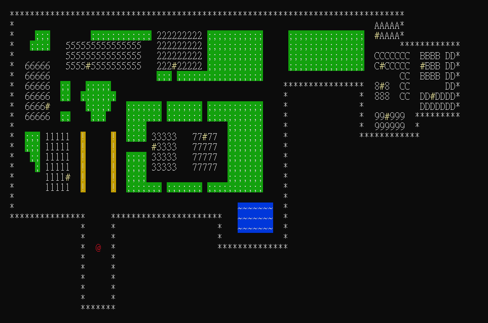
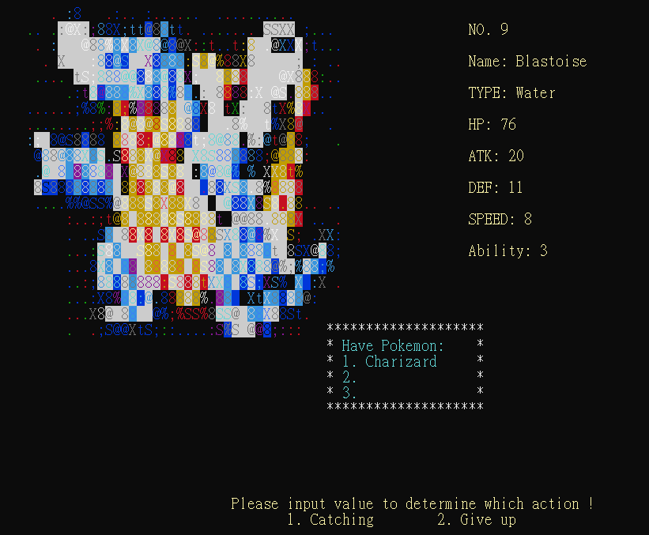
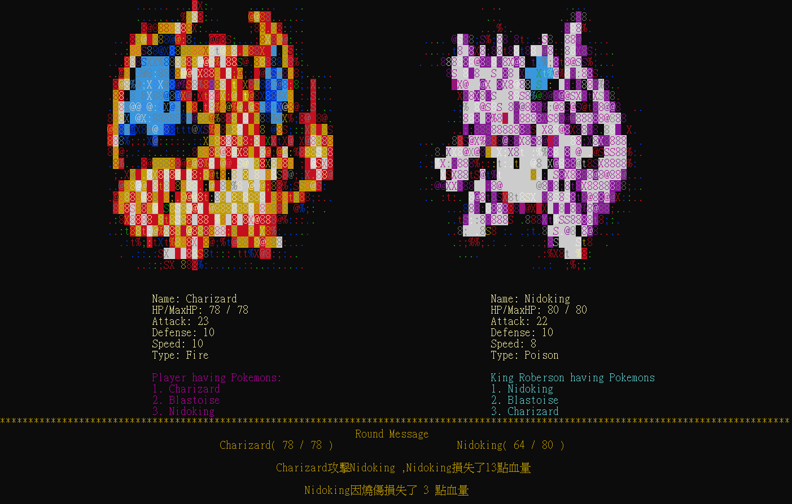
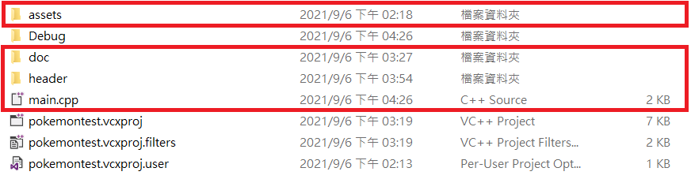
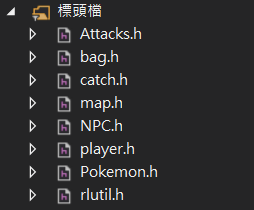
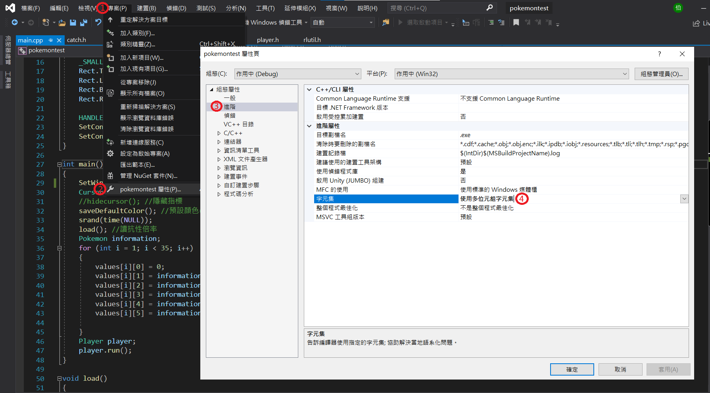

# PokemonGame
本次專案是利用Visual Studio 2019 IDE 以C++程式語言進行軟體開發。
## Introduction
以Pokemon抓寶及道館對戰為方向設計，玩家可以利用W、S、A、D按鍵進行上下左右的移動。

遊戲中有34種Pokemon monsters，行經綠地以及湖中時，相對應的草屬性以及水屬性的Pokemon monsters出現的機率將會大幅提升。

地圖是以元智大學校園進行設計，依據不同建設、景觀進行不同的圖樣編排。

挑戰者可以使用抓到的Pokemon monsters對不同道館進行挑戰獲取積分。

最後遊戲結束時將依據積分的高低獲得不同的獎章展示。
## Getting Started
### 地圖介紹
如下表:

Item | Symbol   
------|-------
草地|綠色 ;
湖畔|藍色 ~
人物|紅色 @
道館入口|黃色 #

<!-- 草地為綠色 ;

湖畔為藍色 ~

人物為紅色 @

道館入口為黃色 # -->

其餘白色部分代表著建築物及圍牆

### 抓取寶可夢
當遇上Pokemon時可以看到Pokemon的資訊以及目前背包裡的Pokemon種類，藉此來判斷要不要抓取此Pokemon，若選擇抓取則有50%的機會抓取成功。

### 道館挑戰
當進入到館挑戰NPC時，按下空白鍵即可進行回合對戰，並且及時顯示每回合的攻擊資訊，當挑戰成功時將會取得積分。

## Usage
本次專案是以Visual Studio 2019 IDE進行編寫，因此流程會以此為中心進行說明。

1. 開啟 Visual Studio -> 建立新的專案 -> 空白專案 -> 建立

2. 複製所有檔案到專案資料夾

3. 回到Visual Studio -> 方案總管 -> 資源檔 -> 右鍵加入現有檔案 -> 加入main.cpp

4. 方案總管 -> 標頭檔 -> 右鍵加入現有檔案 -> 加入所有header的檔案

5. 專案 -> 屬性 -> 組態屬性 -> 進階 -> 字元集 -> 使用多位元組字元集

